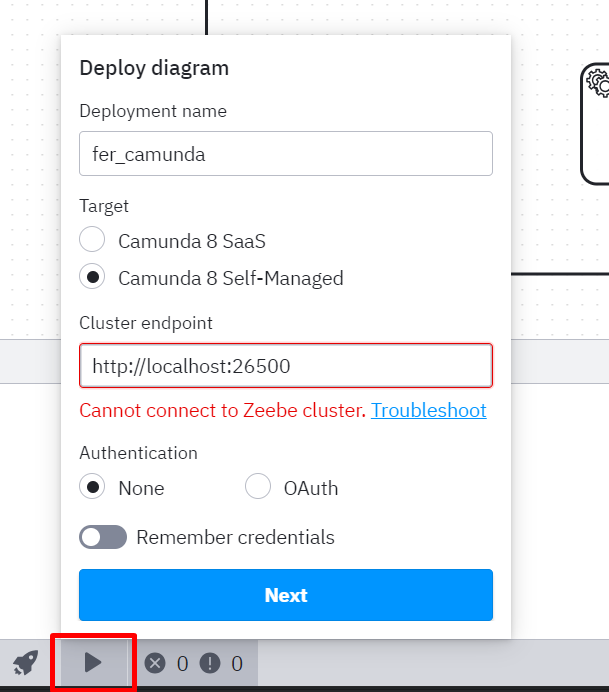
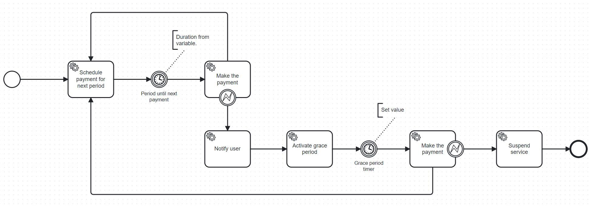
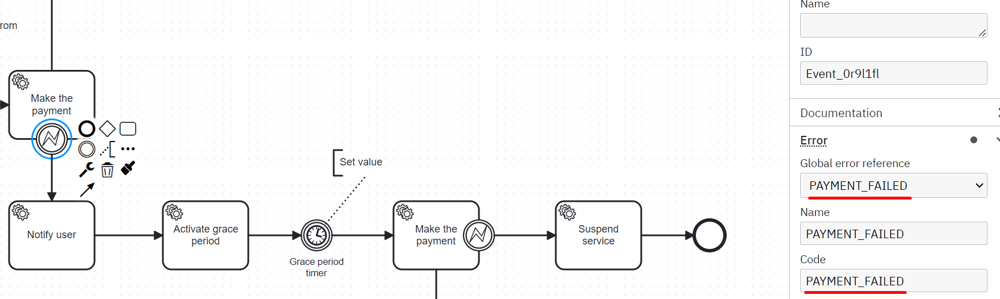
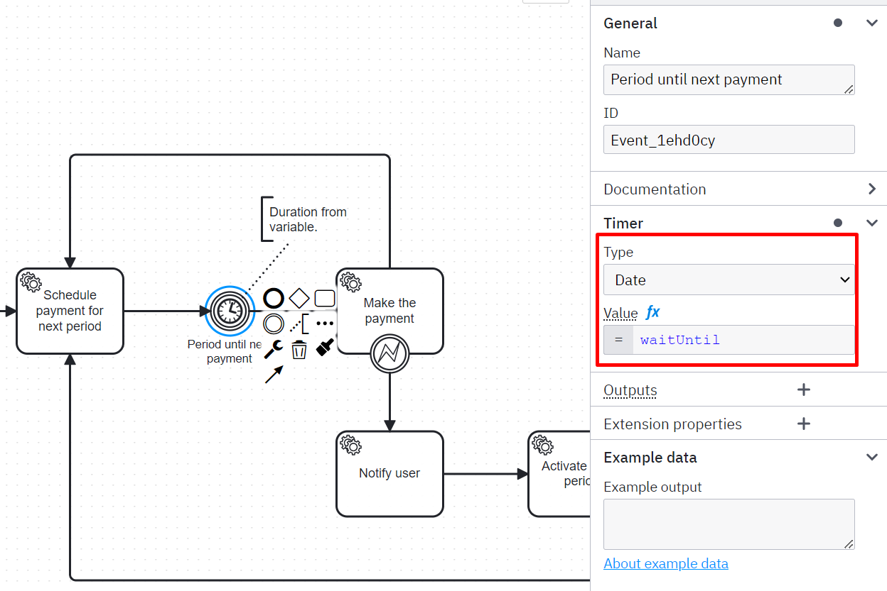

# Fer Camunda Workshop

## Part 1 Showcase of a naive approach

```
checkout naive-approach branch
```

### Introduction

In this part we will show you there are 2 ways to approach to this problem:
- naive approach
- camunda approach

We will showcase the benefits of Camunda using subscription based model.

This model is well known to people paying subscription based service like Netflix and Disney+.

In the naive approach we will not use:
- any of the technologies on the market
- any of the modelling tools (we will use UML to explain what is happening)

In the following picture you can find the subscription based model modelled in UML.


### Application walkthrough

The application implements the subscription based model.
Each call on the diagram is represented by the class in the project:
- schedule payment for the next month -> PaymentSchedulingService
- charge the user -> PaymentGatewayService
- notify the user -> NotificationService
- activate the grace period -> ProductService
- suspend the service -> ProductService
- orchestration of the process -> NaivePaymentProcessingService

In the uml we have 3 external service calls:
- Notification Service
- Payment Service
- Product Service

We will use Wiremock that will act as server for the external calls we use.

The process is triggered by sending a POST on http://localhost:8080/v1/subscriptionBasedPayment

## Demo

You will need to run the application with the profile *naive-implementation*

We have prepared two requests to show 2 possible path in the process:
- successful payment
```jsx
{
    "subscriberId":1,
        "productId":456287,
        "subscriptionDurationUnit":"SECONDS",
        "subscriptionDurationAmount": 15, /*2592000 = 30 dana*/
        "price": 15.00
}
```
- unsuccessful payment
```jsx
{
	"subscriberId":10297734098,
	"productId":456287,
	"subscriptionDurationUnit":"SECONDS",
	"subscriptionDurationAmount": 10, /*2592000 = 30 dana*/
	"price": 1562.00
}
```

Try and execute the process by sending both request.

What are the downsides of this approach?


## Part 2 Introduction to Camunda architecture and modelling

### Camunda introduction

```
Add architecture
```

### Prerequisites
To finish this part you will need to:
- download and install Camunda Modeler https://camunda.com/download/modeler/
- run the *compose.yaml* located in the *Docker* folder of the project
- run the application with *camunda-based-implementation* profile

### Code Changes

The following was added to the project:
- maven dependency *zeebe-client-java*
- ZeebeConfig class
- application.yml is updated with a property to enable communication with the Zeebe

### Demo

On the following picture simple process is given we will work on


## Part 3 Introduction to Camunda Service Task

```
Goal is to show how to define the behaviour of the process using a code
```

The following was added to the project:
- CamundaSimpleServiceTask
- CamundaSimpleServiceTask2


### Demo

On the following picture simple process is given we will work on


## Part 3 Introduction to Camunda Timer Task

```
Goal is to show how to control the process with the variable defined outside of the code
```

### Demo

On the following picture simple process is given we will work on


### Testovi
Testove možemo pokrenuti koristeći JUnit na razini paketa `hr.ht.workshop.fer.subscriptionbasedpayments`.

Primijetiti da naive testovi prolaze, a padaju Camunda testovi. Želja nam je poboljšati postojeći projekt uz pomoć Camunde koja će nam pomoći s praćenjem izvršavanja poslovnog procesa. Cilj je da nakon dodavanja Camunde u projekt prođu i predefinirani Camunda testovi.

## 2. Što nam je sve potrebno za implementaciju pomoću Camunde?
1. Moramo dodati Camunda dependency u projekt
    1. I konfigurirati application propertiesa
2. Moramo pokrenuti Docker container sa Zeebe brokerom i Camunda Operate dashboardom
3. Moramo modelirati poslovni proces pomoću Camunda modelerea
    1. I deployati model u Zeebe broker
4. Dodati u projekt JobWorkere za svaki task u modelu
    1. Dodati potrebne @Configuration klase
    2. Prilagoditi klasu CamundaPaymentProcessingService kako bi se startao poslovni proces na REST API request

## 3. Camunda dependency
Za korištenje Camunde potrebno je dodati sljedeći Maven dependency:
```
<dependency>
    <groupId>io.camunda</groupId>
    <artifactId>zeebe-client-java</artifactId>
    <version>8.5.0</version>
</dependency>
```

### 3.1. Application properties
Nakon što dodamo Camunda dependency moramo i dodati application properties koji će definirati adresu na kojoj će se nalaziti Zeebe broker:
```
zeebe:
    broker:
        contactPoint: "http://localhost:26500" /*26500 je defaultni port*/
```

Također, prilikom pokretanja Camunda implementacije koristit ćemo sljedeći Spring profile:
```
camunda-based-implementation
```

### 3.2. WireMock konfiguracija
Komunikaciju prema Paymnet gatewayu, Notification klijentu i Product klijentu mockamo uz pomoć WireMocka.
WireMock je dodan za testove, ali kako bi ga osposobili i prilikom pokretanja naive ili camunda profila potrebno je kreirati
konfiguracijsku klasu:

```java
@Configuration
@Profile(Profiles.CAMUNDA_BASED_IMPLEMENTATION)
public class WireMockConfig {

    @Value("${wiremock.server.port}")
    private int wiremockServerPort;

    @Bean(initMethod = "start", destroyMethod = "stop")
    public WireMockServer wiremockServer() {
        WireMockServer server = new WireMockServer(WireMockConfiguration.wireMockConfig()
                .port(wiremockServerPort));
        server.start();
        return server;
    }
}
```

Uz to potrebno je test/resources/mappings staviti json primjere zahtjeva i odgovora prema Mockanim klijentima. Primjere možete kopirati s gita.

Bitno je da simulacija komunikacije prema klijentima uspješno prođe kako bi mogli pratiti kretanje instanci poslovnog procesa u Camunda Operateu.

## 4. Pokretanje Zeebe brokera
> Zeebe broker je ključna komponenta u Camunda verziji 8. On upravlja tokom poslovnog procesa i odgovoran je za praćenje stanja pojedine instance procesa.
> Također, omogućava horizontalno skaliranje što znači da se može lako prilagoditi povećanju opterećenja ili broju aktivnih procesa.

Za pokretanje brokera potrebno je također pokrenuti i container za Elasticsearch. Elasticseach u ovom slučaju služi za pohranu podataka o toku procesa i instancama.
Uz Zeebe broker koristit ćemo i Camunda Operate.

> Camunda Operate je alat koji pruža sučelje za pregled, analizu i upravljanje poslovnih procesa u stvarnom vremenu.
> S pomoću ovog alata pratit ćemo izvršavanje pojedinih procesa, identificirati probleme u modelu/kodu i sl.

<details>
<summary>Pripremljena Docker compose datoteka:</summary>

```
version: '3.7'
services:
  zeebe:
    container_name: zeebe_broker
    image: camunda/zeebe:latest
    environment:
      - ZEEBE_LOG_LEVEL=info
      - ZEEBE_BROKER_NETWORK_HOST=0.0.0.0
      - ZEEBE_BROKER_GATEWAY_ENABLE=true
      - ZEEBE_BROKER_GATEWAY_NETWORK_HOST=0.0.0.0
      - ZEEBE_BROKER_EXPORTERS_ELASTICSEARCH_CLASSNAME=io.camunda.zeebe.exporter.ElasticsearchExporter
      - ZEEBE_BROKER_EXPORTERS_ELASTICSEARCH_ARGS_URL=http://elasticsearch:9200
    ports:
      - "26500:26500"
      - "26501:26501"
      - "26502:26502"
    networks:
      - camunda-platform

  elasticsearch:
    image: docker.elastic.co/elasticsearch/elasticsearch:8.13.0
    environment:
      - discovery.type=single-node
      - xpack.security.enabled=false
    ports:
      - "9200:9200"
      - "9300:9300"
    networks:
      - camunda-platform

  operate:
    container_name: operate
    image: camunda/operate:latest
    environment:
      - camunda.operate.elasticsearch.url=http://elasticsearch:9200
      - camunda.operate.zeebeElasticsearch.url=http://elasticsearch:9200
      - camunda.operate.zeebe.gatewayAddress=zeebe:26500
    ports:
      - "8080:8080"
    depends_on:
      - zeebe
      - elasticsearch
    networks:
      - camunda-platform


networks:
  camunda-platform:
```
</details>

Za pokretanje containera iz compose file-a koristimo sljedeću naredbu u terminalu:
```
docker-compose up -d
```

Ako je potrebno Docker Desktop možemo preuzeti s linka https://www.docker.com/products/docker-desktop/

## 5. Modeliranje poslovnog procesa pomoću Camunda modelera

- Preuzeti i instalirati Camunda modeler s [https://camunda.com/download/modeler/](https://camunda.com/download/modeler/)

> **Prilikom kreiranja modela potrebno je odabrati Camunda model verzije 8!**

Koje korake imamo u poslovnom procesu pretplate?
1. Počinjemo s kreiranjem pretplate na zadani datum (koji se izračuna s obzirom na trajanje intervala preplate)
2. Nakon što zadani datum prođe želimo napraviti naplatu
3. Ako je plaćanje  uspješno onda ponovno kreiramo pretplatu za sljedeći interval
4. Ako pretplata nije uspješna želimo obavijestiti korisnika o grešci
5. Nakon obavijesti korisniku želimo aktivirati određeni period čekanja
6. Nakon što prođe period čekanja želimo ponoviti plaćanje
7. Ako plaćanje  ne prođe niti nakon zadanog perioda poništava se pretplata

Koje "gradivne elemente" možemo koristiti za modeliranje?
- **start event**  - koji označava početak poslovnog procesa
- **(service) taskove** - koji predstavljaju pojedine aktivnosti koje se izvršavaju prilikom poziva koda (JobWorkera) ili prilikom izvođenja određene logike
    - neki taskovi kao ishod mogu imati i grešku za što koristimo "**error boundary event**"
- **timer evente** - predstavljaju aktivnosti koje se pokreću na određeni datum i vrijeme ili nakon određenog intervala
- **end event** - koji označava kraj poslovnog procesa

### Deploy modela
Kada smo gotovi sa modeliranjem ili želimo testirati trenutno model moramo ga deployati na Zeebe broker:



Je li do sada sve prošlo OK možemo testirati pokretanjem aplikacije i pristupanjem Camunda Operateu na sljedećem linku:
> http://localhost:8080/

Završni model bi trebao biti sličan modelu niže:




## Kreiranje ZeebeClienta
> Zeebe Client je library koji nam omogućava komunikaciju sa Zeebe brokerom. Pomoću Zeebe clienta ćemo startati instance poslovnog procesa, delegirati zadatke JobWorkerima itd.

U našem slučaju konfigurirat ćemo ZeebeClient kao Bean u klasi `ZeebeConfig`. U ovoj konfiguracijskoj klasi najbitnije je navesti "grpcAddress" odnosno adresu na kojoj se nalazi Zeebe broker.

```java
@Bean
public ZeebeClient zeebeClient() {
        return ZeebeClient.newClientBuilder()
        .grpcAddress(URI.create(contactPoint))
        .usePlaintext()
        .build();
        }
```

Nakon što smo kreirali Bean možemo ga iskoristiti u klasi 'CamundaPaymentProcessingService' kako bi kreirali instance poslovnog procesa.
Instancu kreiramo za svaki REST API poziv.

```java
    zeebeClient.newCreateInstanceCommand()
    .bpmnProcessId("subscription_process")
    .latestVersion()
    .variable("subscription",subscriptionBasedPayment) /* ulazni objekt postavljamo kao varijablu za instancu procesa koji pokrećemo kako bi ju mogli dohvatiti u workerima */ 
    .send()
    .join();
```
Kreiranje instance omogućit će nam praćenje izvršavanje poslovnog procesa za svakog pojedinog korisnika unutar Camunda Operatea.

## Kreiranje JobWorkera
U našem modelu imamo 6 service taskova što znači da nam treba 6 novih klasa koje će biti JobWorkeri.

Svaka klasa mora imati sljedeće:
- pristup zeebeClient klasi
- pristup servisu koji sadrži poslovnu logiku za taj service task
- metodu za registraciju novog workera
- "handler" metodu koja izvršava kod unutar service taska

### Registracija workera
```java
@PostConstruct
    public void subscribeToJobType() {
        zeebeClient.newWorker()
                .jobType("activate-grace-period-service") /*bitno je koristiti ID koji se podudara sa IDem iz BPMN modela unutar taga bpmn:serviceTask*/
                .handler(this::handleJob) /* naziv metode koja će izvršiti kod za ovaj service task*/
                .open();
    }
```


### HandleJob
Unutar handleJob metode (ili metode drugog imena specificiranog prilikom registracije workera) pozivamo metode iz servisnog layera.
Kao pomoć nam može poslužiti kod iz 'naive' pristupa tj. klase 'NaivePaymentProcessingService'.

Primjer za Worker koji će aktivirati grace period:
```java
        /* dohvaćanje  subscription varijable iz trenutnog procesa*/
        Map<String, Object> subscriptionMap = (Map<String, Object>) job.getVariablesAsMap().get("subscription");
        SubscriptionBasedPayment subscription = objectMapper.convertValue(subscriptionMap, SubscriptionBasedPayment.class);
        /* pozivanje metode iz servisnog layera*/
        productService.activateGracePeriod(subscription.getProductId());
        /*uspješno završavanje taska*/
        client.newCompleteCommand(job.getKey())
                .send();
```

### Greške u poslovnom procesu
Pojedini taskovi unutar poslovnog procesa mogu završiti u grešci. Primjer takvog taska u našem modelu je "Make the payment" task.
U slučaju kada naplata pretplate nije uspješna potrebno je vratiti grešku koju će Camunda model prepoznati i sukladno s time nastaviti daljnje izvođenje poslovnog procesa.

Kako bi model prepoznao grešku potrebno je unutar modela definirati 'errorCode', a zatim isti errorCode iskoristiti handle metode unutar workera.

Primjer definiranje 'errorCode' vrijednosti unutar modela:



Korištenje 'errorCode' vrijednosti u kodu:
```java
client.newThrowErrorCommand(job.getKey())
                    .errorCode("PAYMENT_FAILED")
                    .errorMessage(e.getMessage())
                    .send();
```

### Prosljeđivanje vrijednosti iz workera u model
U našem modelu naplatu je potrebno raditi periodično na određene datume. Te datume izračunavamo unutar koda na temelju primljenih vrijednosti 'subscriptionDurationUnit' i 'subscriptionDurationAmount'.
Tu izračunatu vrijednost želimo proslijediti iz koda nazad u model. To možemo napraviti postavljanjem nove varijable unutar instance poslovnog procesa. Uz to potrebno je ime varijable
povezati sa željenim eventom.

Dodavanje varijable na instancu poslovnog procesa:
```java
    /**ZeebeClient prihvaća mapu.**/
    Map<String, Object> variables = job.getVariablesAsMap();
        /**Potrebno je java LocalDateTime formatirati u ISO 8601 format s kojim radi Camunda, ali i pravilno postaviti offset za vremensku zonu**/
        variables.put("waitUntil", subscription.getNextPaymentDueDateTime().atOffset(ZoneOffset.of("+02:00")).format(DateTimeFormatter.ISO_OFFSET_DATE_TIME));

        /**Dodavanje varijable*//
        client.newCompleteCommand(job.getKey())
        .variables(variables)
        .send()
        .join();
```

Povezivanje varijable i eventa unutar Camunda modelera:



## Pokretanje Camunda testova
Kako bi mogli pokrenuti Camunda testove potrebno je dodati sljedeći dependency:
```
    <dependency>
        <groupId>io.camunda</groupId>
        <artifactId>zeebe-process-test-extension-testcontainer</artifactId>
        <version>8.5.0</version>
        <scope>test</scope>
    </dependency>
```

Zatim je potrebno naš model (bpmn datoteku) dodati u resources folder unutar packagea src/test.
Kao treći korak potrebno je pobrinuti se da se WireMock koji se pokreće prilikom pokretanje Camunda aplikacije ne
pokrene i prilikom testova jer kod testova imamo već definiranu klasu 'AbstractWiremockApplicationTest'.

Kako bi to izbjegli klase 'CamundaPaymentProcessingServiceTests', 'FerCamundaWorkshopCamundaApproachApplicationTests', 'FerCamundaWorkshopNaiveApproachApplicationTests'
proširujemo s dodatnim Spring Boot profilom "test", npr:
```java
@ActiveProfiles({Profiles.CAMUNDA_BASED_IMPLEMENTATION, "test"})
```

Dok klasi 'WireMockConfig' dodajemo pravilo da se ne pokreče dok je aktivan test profil:
```java
@Profile(Profiles.CAMUNDA_BASED_IMPLEMENTATION + " & !test")
```
