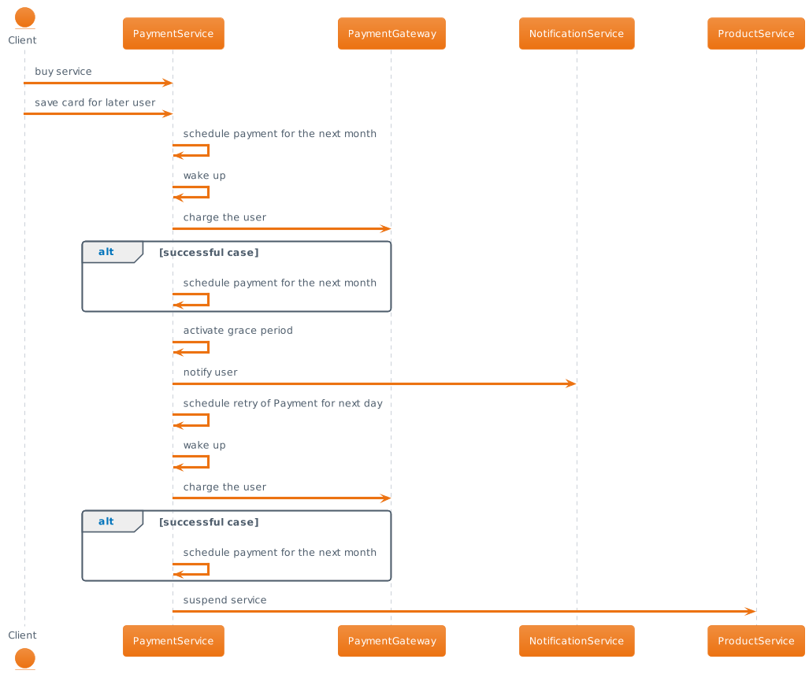
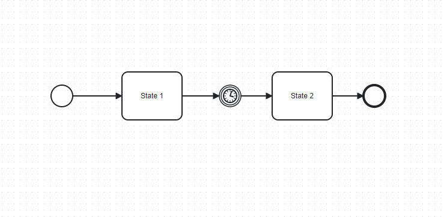
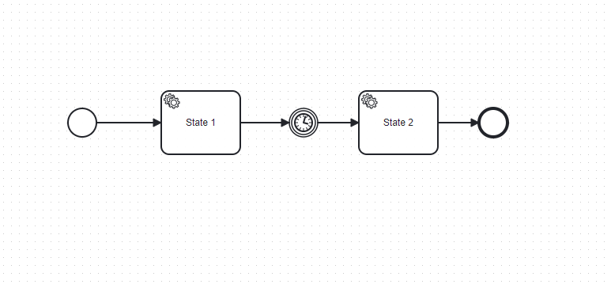
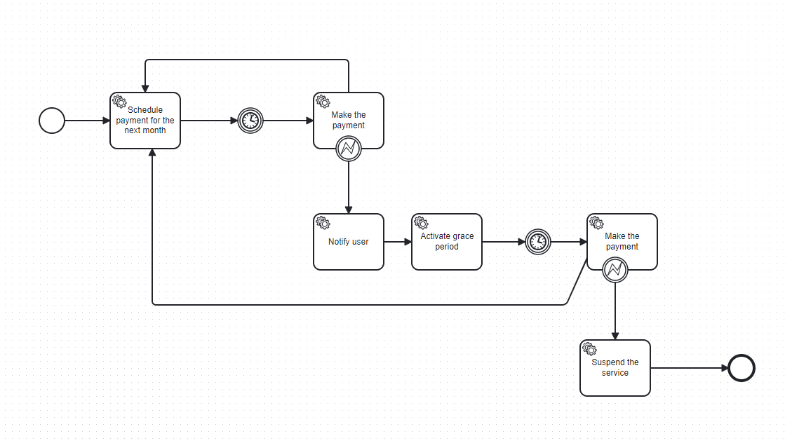

# Fer Camunda Workshop

## Part 1 Showcase of a naive approach

```
checkout naive-approach branch
```

### Introduction

In this part we will show you there are 2 ways to approach to this problem:
- naive approach
- camunda approach

We will showcase the benefits of Camunda using subscription based model.

This model is well known to people paying subscription based service like Netflix and Disney+.

In the naive approach we will not use:
- any of the technologies on the market
- any of the modelling tools (we will use UML to explain what is happening)

In the following picture you can find the subscription based model modelled in UML.



### Application walkthrough

The application implements the subscription based model.
Each call on the diagram is represented by the class in the project:
- schedule payment for the next month -> PaymentSchedulingService
- charge the user -> PaymentGatewayService
- notify the user -> NotificationService
- activate the grace period -> ProductService
- suspend the service -> ProductService
- orchestration of the process -> NaivePaymentProcessingService

In the uml we have 3 external service calls:
- Notification Service
- Payment Service
- Product Service

We will use Wiremock that will act as server for the external calls we use.

The process is triggered by sending a POST on http://localhost:8080/v1/subscriptionBasedPayment

## Demo

You will need to run the application with the profile *naive-implementation*

We have prepared two requests to show 2 possible path in the process:
- successful payment
```jsx
{
    "subscriberId":1,
        "productId":456287,
        "subscriptionDurationUnit":"SECONDS",
        "subscriptionDurationAmount": 15, /*2592000 = 30 dana*/
        "price": 15.00
}
```
- unsuccessful payment
```jsx
{
	"subscriberId":10297734098,
	"productId":456287,
	"subscriptionDurationUnit":"SECONDS",
	"subscriptionDurationAmount": 10, /*2592000 = 30 dana*/
	"price": 1562.00
}
```

Try and execute the process by sending both request.

What are the downsides of this approach?


## Part 2 Introduction to Camunda architecture and modelling

### Camunda introduction

```
Add architecture
```

### Prerequisites
To finish this part you will need to:
- download and install Camunda Modeler https://camunda.com/download/modeler/
- run the *compose.yaml* located in the *Docker* folder of the project
- run the application with *camunda-based-implementation* profile
- access the camunda operate http://localhost:8080

### Code Changes

The following was added to the project:
- maven dependency *zeebe-client-java*
- ZeebeConfig class
- application.yml is updated with a property to enable communication with the Zeebe

### Demo

On the following picture simple process is given we will work on




## Part 3 Introduction to Camunda Service Task

```
Goal is to show how to define the behaviour of the process using a code
```

The following was added to the project:
- CamundaSimpleServiceTask
- CamundaSimpleServiceTask2


### Demo

On the following picture simple process is given we will work on




## Part 4 Introduction to Camunda Timer Task

```
Goal is to show how to control the process with the variable defined outside of the code
```

### Demo

On the following picture simple process is given we will work on


## Part 5 Introduction to Camunda Timer Task

```
Goal is to show how to control the process with Timer task defined as Date
```

### Demo

On the following picture simple process is given we will work on


## Part 6 Subscription model task

```
Goal is to define the process and implement the missing part in the model
```

### Demo

On the following picture simple process is given we will work on




